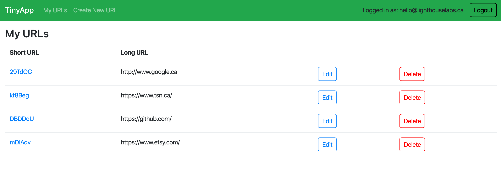
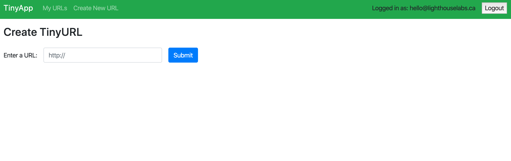
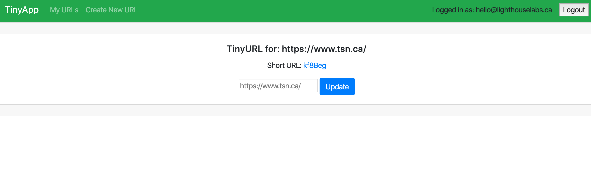

# TinyApp Project

TinyApp is a full stack web application built with Node and Express that allows users to shorten long URLs (à la bit.ly).

Users will be able to log in and execute the major functions of CRUD, while protecting their user information with current best practice encryption methods.

## Final Product

## Dependencies

- Node.js
- Express
- EJS
- bcrypt
- body-parser
- cookie-session
- morgan

## Getting Started

- Install all dependencies (using the `npm install` command).
- Run the development web server using the `node express_server.js` command.